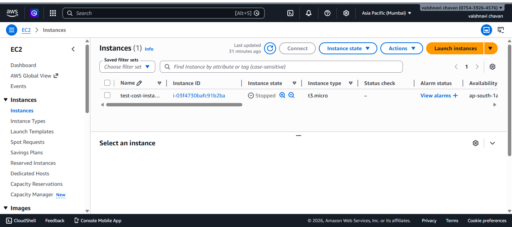
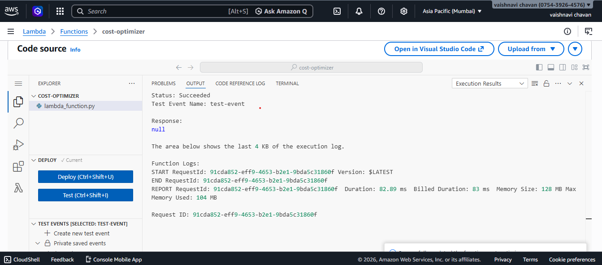
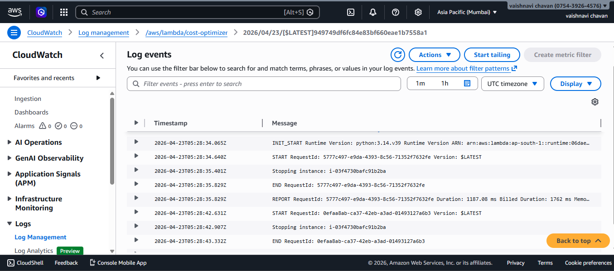
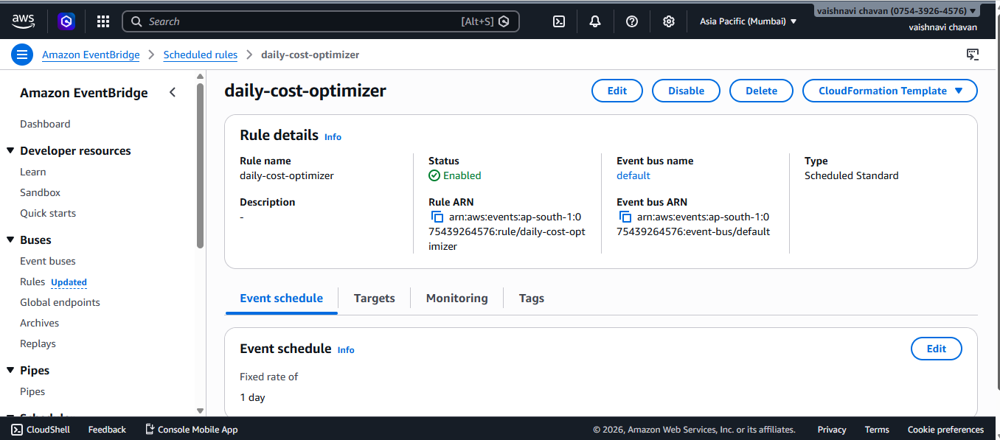

# 🚀 Automated AWS Cost Optimizer

## 📌 Overview
This project automatically reduces AWS costs by identifying and stopping idle EC2 instances using a serverless architecture.

---

## 🧰 Technologies Used
- AWS Lambda
- Amazon EC2
- Amazon CloudWatch
- Amazon EventBridge
- Python (boto3)

---

## ⚙️ How It Works
1. Lambda function fetches all EC2 instances  
2. Retrieves CPU utilization from CloudWatch  
3. If CPU usage < 10%, instance is stopped  
4. EventBridge triggers the function daily  

---

## 🏗️ Architecture

---

## 📊 Output Screenshots

### 🖥️ EC2 Instance Stopped

### ⚡ Lambda Execution

### 📈 CloudWatch Logs

### ⏰ EventBridge Rule

---

## ✨ Features
- Automated cost optimization  
- Serverless (no infrastructure management)  
- Scalable & efficient  
- Real-time monitoring via logs  

---

## 🚀 Future Improvements
- Tag-based filtering  
- Email alerts using SNS  
- Multi-region support  

---

## 👩‍💻 Author
**Vaishnavi Chavan**
